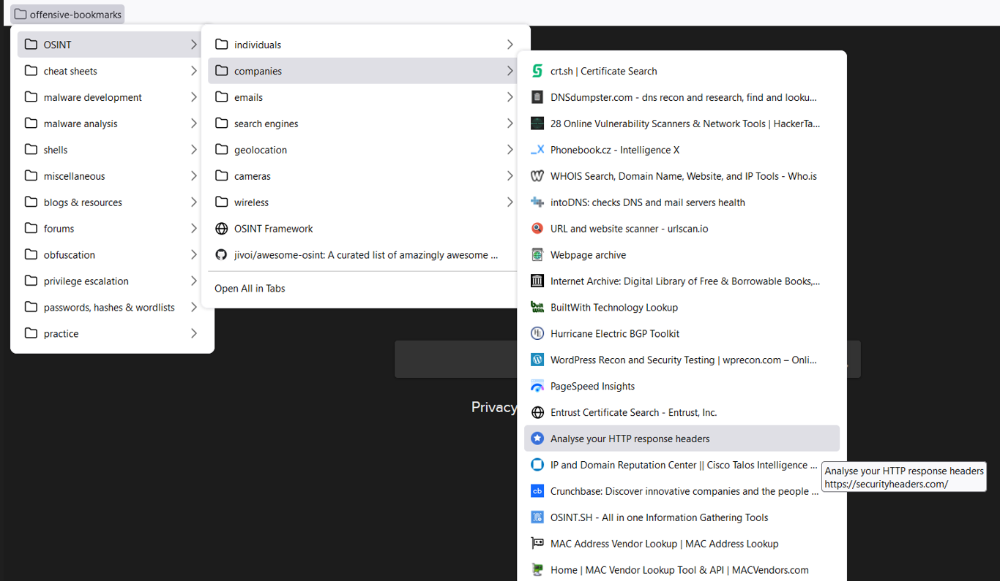

# Offensive Bookmarks

## A collection of bookmarks for penetration testers, bug bounty hunters,  malware developers, reverse engineers and anyone who is just interested in infosec topics.

## Description

Offensive Bookmarks is a curated collection of browser bookmarks specifically designed for security professionals, including penetration testers, malware developers, and reverse engineers. This comprehensive repository provides a valuable resource for individuals involved in cybersecurity research, vulnerability assessment, and offensive security activities.

## How to install
* Download [offensive-bookmarks.html](https://github.com/kargisimos/offensive-bookmarks/blob/master/offensive-bookmarks.html)
* **Firefox**: Bookmarks -> Manage bookmarks -> Import and Backup -> Import Bookmarks from HTML -> select **offensive-bookmarks.html**
* **Edge**: Settings -> Profiles -> Import browser data -> Import from other browsers -> Import from Favorites or bookmarks HTML file -> select **offensive-bookmarks.html**
* **Chrome**: Bookmarks -> Import bookmarks and settings -> Bookmarks HTML file -> select **offensive-bookmarks.html**

## Key features

The general categories are:

* **OSINT**

>face recognition, username lookup, subdomains, SSL certificates, web technologies, assets, urls, whois info, online vulnerability scanners, web archives, mac address lookup, email lookup, search engines, geolocation, camera, wireless

* **cheat sheets**

>web cheat sheets, linux cheat sheets, windows cheatsheets, offensive tools cheat sheets

* **malware development**

>code repositories, blogs, youtube channels

* **malware analysis**

>tools, sandboxes, resources

* **shells**

>collection of reverse shells

* **miscellaneous**

>encoders, decoders, file transfers, file formatting

* **blogs & resources**

>general info blogs, youtube channels

* **forums**

>forums

* **obfuscation**

>command prompt obfuscators, powershell obfuscators, python obfuscators, javascript obfuscators, php obfuscators, C/C++ obfuscators, .NET obfuscators

* **privilege escalation**

>windows privilege escalation, linux privilege escalation

* **passwords, hashes & wordlists**

>default passwords, wordlists, cracking tools

* **practice**

>cybersecurity labs